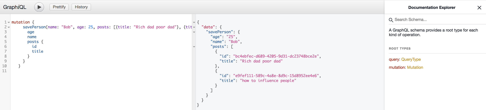
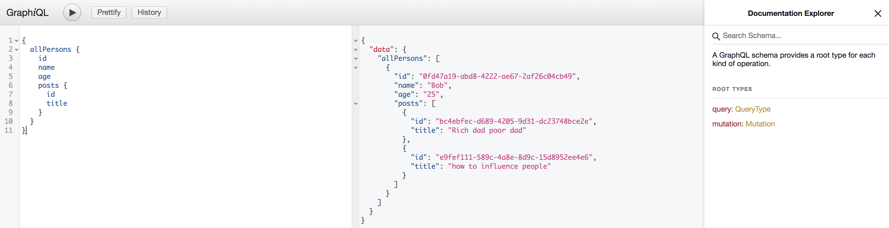
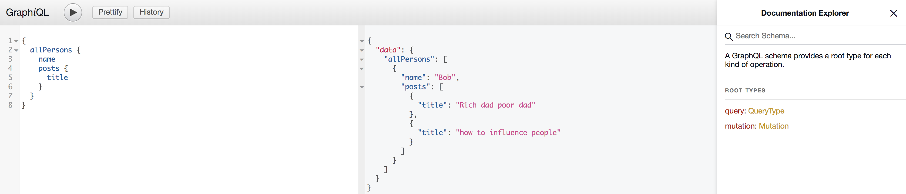

## graph-ql-java tutorial

A sample application demonstrating graph-ql java for query and mutation use cases

## How to run
    $ git clone https://github.com/SanjayaKumarSahoo/graph-ql-java-tutorial.git
    $ cd graph-ql-java-tutorial
    $ mvn clean install
    $ mvn jetty:run

## How to test
    Go to http://localhost:8080
    Run mutation and then fetch by running query
    
```
   mutation {
     savePerson(name: "Bob", age: 25, posts: [{title: "Rich dad poor dad"}, {title: "how to influence people"}]) {
       age
       name
       posts {
         id
         title
       }
     }
   }
```


and then query 
```
{
  allPersons {
    id
    name
    age
    posts {
      id
      title
    }
  }
}
```


or let the client to provide attributes what ever they required
```
{
  allPersons {
    name
    posts {
      title
    }
  }
}

```

